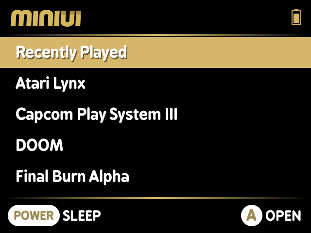
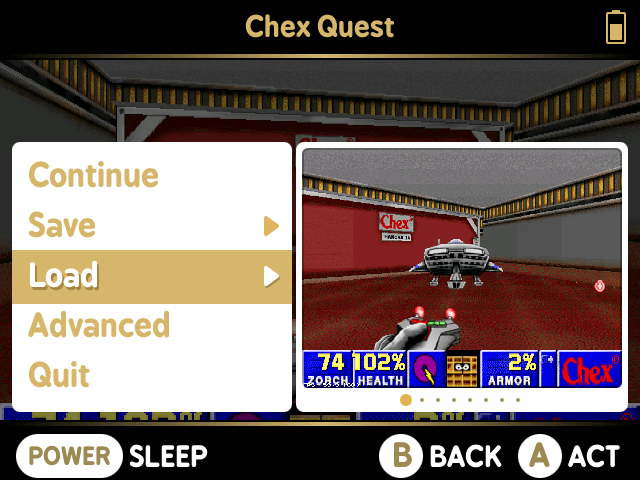
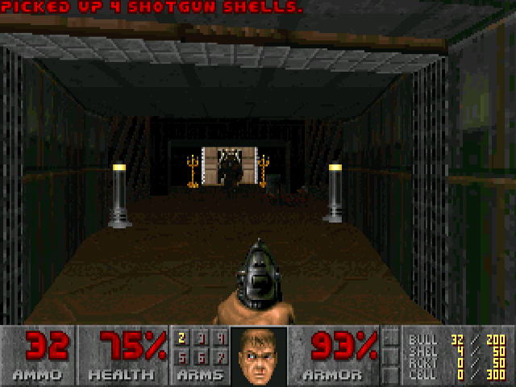

# MiniUI Extra Extras
   
### _Extra Retroarch cores for MiniUI on the Miyoo Mini_ ###
Utilizing the very convenient modular structure of [MiniUI](https://github.com/shauninman/MiniUI), we can add a lot of RetroArch cores that already work in [Onion](https://github.com/jimgraygit/Onion)!
This initial batch is really only the cores I made for myself based on the systems I wanted to play. Additional cores may be provided upon request (or PR). 

Cores are provided AS-IS as I am not the one who compiled them and I will likely not be making any changes to cores in order to get things working. DO REMEMBER to not pester shauninman, the creator of MiniUI, about any of these cores as they are provided unofficially. 

## Installation
- Download the latest release and extract the contents of the zip file to the root of your MiniUI SD card
- Transfer your ROM files into the appropriate folders (don't forget BIOS files for the cores that need them!)
- Eject your SD, insert it into your Miyoo Mini and enjoy! 🎉

## Included Cores (So far)
| System | PAK name | Core | Default ROM Folder | ROM Extensions | Requires BIOS? |
| ------ | -------- | ---- | ------------------ | -------------- |--------------- |
| CPS3 | `CPS3.pak` | `fbalpha2012_cps3_libretro.so` | \Roms\Capcom Play System III (CPS3) | `.zip`,`.chd` | No |
| Doom | `DOOM.pak` | `prboom_libretro.so` | \Roms\Doom (DOOM) | `.wad` | `prboom.wad` |
| Final Burn Alpha (2012) | `FBA.pak`  | `fbalpha2012_libretro.so` | \Roms\Final Burn Alpha (FBA) | `.zip`,`.chd` | `neogeo.zip` |
| Atari Lynx | `LYNX.pak` | `handy_libretro.so` | \Roms\Atari Lynx (LYNX) | `.zip`,`.lnx` | `lynxboot.img` |
| NeoGeo Pocket/Pocket Color | `NGP.pak` | `mednafen_ngp_libretro.so` | \Roms\NeoGeo Pocket Color (NGP) | `.zip`,`.ngp`,`.ngc` | No |
| NEC SuperGrafx | `SGFX.pak` | `mednafen_supergrafx_libretro.so` | \Roms\SuperGrafx (SGFX) | `.pce`,`.zip` | No |
| Bandai WonderSwan/WonderSwan Color | `WSC.pak` | `mednafen_wswan_libretro.so` | \Roms\WonderSwan Color (WSC) | `.ws`,`.wsc`,`.zip` | No

## Notes
### General
- If colors are distorted when first launching a ROM, try changing the display filter or scaling.
### Final Burn Alpha
- Large NeoGeo ROMs take _awhile_ to load, so if you see a black screen, just give it a minute. 
  - Save states will not bypass the time it takes to initially load the ROM.
- You can create additional ROM folders to separate some Arcade systems. For example, you could make a folder titled "NeoGeo (FBA)" and put all of your NeoGeo ROMs there to have a dedicated entry. DO NOTE that this method will make all folders that share the "FBA" core share settings.
- Adding the NeoGeo unibios to your `neogeo.zip` is _highly_ reocommended as it adds the ability to switch between AES/MVS modes and region on boot and adds cheats for some games (accessible by pressing SELECT + R1 by default). 
### Doom
- The PRBoom core is compatible with "Boom" and "Vanilla" compatible mods. Mods work by ~~abusing~~ utilizing how MiniUI handles folders and multi-disc games. This is acheived by creating a folder for each mod in your ROM folder and including both the parent WAD and mod WAD.
  - **You WILL need to enable the feature "Look on parent folders for IWAD" in the Picoarch advanced settings for mods to work properly!**
  - Example: `SD:\Roms\DOOM (DOOM)\Chex Quest\` has both `chex.wad` and `doom2.wad` inside, with a `Chex Quest.m3u` file as well with the contents `chex.wad`.
  - This also cleans up the ROM list considerably
  - You can still launch normal WADs without making folders or `.m3u` files
  - Confirmed working mods: Chex Quest, Back To Saturn X - Episode 1, Batman Doom, Doom 64 for Doom II, Doom the Way Id Did, Jenesis, SCYTHE.
- Rumble works and (I think) is enabled by default
- DO NOT hit "Quit" from within the Doom main menu! This will crash Picoarch and you will have to force restart your system by holding MENU and POWER!
- Changing the internal resolution to 640x400 is possible in Picoarch's advanced menu, but performance may drop for more intensive mods. 
### WonderSwan & NeoGeo Pocket Color
- If you want separate folders for each system version, you can create them under ROMs; just be sure to include the same TAG that is in parenthesis. Example: "NeoGeo Pocket (NGP)"

## Special Thanks
- To [Shauninman](https://github.com/shauninman), creator of [MiniUI](https://github.com/shauninman/MiniUI)
- eggs, [jimgraygit](https://github.com/jimgraygit) and everyone else that works on [Onion](https://github.com/jimgraygit/Onion)
- The Retro Game Handhelds Discord and it's users
